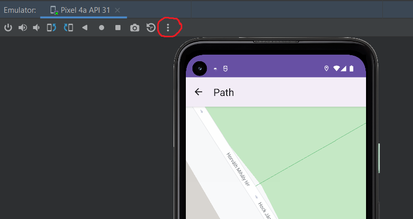

# Test plan and documentation

Author of the document:

-   Ádám Tran
-   Jasper Viktor Szabó

Responsible for the writing exploratory tests and observations:

-   Ádám Tran
-   Jasper Viktor Szabó

Unless explicitly written you can reproduce these tests with emulator or real, physical device.

## Exploratory tests

### 1. test

Test title: Google sign-in testing.

Test objective: Testing whether the user is able to log in with his/her Google account.

Test steps:

-   Start the application
-   Click-on Google Sign-in in the middle of the screen.

Test result:

-   Successful.

### 2. test

Test title: Tracking service testing between 2 near locations.

Test objective: Testing whether we can start the service and the service sends location information accordingly

Test steps:

-   Log in with Google-account
-   Start tracking service (if you are using emulator you will have to set the locations manually in the emulator settings menu).
-   Click on sessions in the bottom right corner.
-   Scroll to the last session (this is the one you just started).
-   Click on the map icon on the right (it is important to click the map icon and not something else on the same session line, because that will take you to the session's infomation.)

Test results:

-   Successful. The road is visible, always zoomed in to fill the entire screen. The point is following our position on the map.

### 3. test

Test title: Log-out testing

Test objective: Testing whether logging out works properly.

Test steps:

-   After logging in with Google account
-   Click on Home tab on the bottom of the screen
-   Click on Log out on the bottom left of the screen. This takes you back to the log-in page
-   Exit the application.
-   Start the application.

Test results:

-   The user is logged out after restarting the application. Successful

### 4. test

Test title: Starting app after logging in

Test objective: Testing how the application reacts to starting after logging in.

Test steps:

-   Log in with Google account
-   Exit the application
-   Start the application

Test result:

-   Anomaly detected. There is a brief moment when the log-in screen is displayed despite being logged in. This is presumably caused due to slow cpu loading time. The button can be clicked, but does not crash the application.

### 5. test

Test title: Force stopping the application

Test objective: Testing how sessions react to force stopping the application.

Test steps:

-   Log in with Google account
-   Start session
-   Exit application
-   Enter phone settings
-   Search for Jay
-   Click on Jay app (illustration how it looks like in emulator)
-   Click on Force stop
-   Start application
-   Click on Session on the bottom tab
-   Scroll down and click the last session

Test result:

-   Anomaly detected. Session keeps running after force stopping the application, but the location is not refreshed.
    Proposition to improve: Store in a settings file whether a user is logged in and display fragments accordingly.

### 6. test

Test title: Changing location to irreal distances from emulator settings

Test objective: Testing whether the app will recognize if a user is moving unrealistically.

Test steps:

-   Start application with emulator
-   Log in with Google account
-   Start tracking service
-   Go to emulator settings

-   Set the location on the Single points tab (you can select a new location by searching for a place and clicking Set location on the bottom left of the screen)

-   Switch back to the map display

Test result:

-   Anomaly detected. The app does not pay attention to inconsistent movement.
-   Proposition to improve: detect if the user moves in unusual ways and inform the user about this in the form of a popup window.

### 7. test

Test title: Starting multiple sessions

Test objective: Testing whether it is possible to start multiple sessions

Test steps:

-   Log in with Google account
-   Start tracking service
-   Exit application
-   Enter phone settings
-   Search for Jay
-   Click on Jay app (illustration how it looks like in emulator)

      

-   Click on Force stop

      

-   Start application
-   Start recording
-   Click on Sessions on the bottom right

Test result:

-   Anomaly detected. It is possible to start more than 1 session which is useless because they are tracking the same user.

      

### 8. test

Test title: Deleting sessions

Test objective: Testing whether it is possible to delete sessions

Test steps:

-   Log in with Google account
-   Start recording
-   Stop recording (this step is necessary for an ended session to exist)
-   Click on Sessions on the bottom right
-   Click on the Delete sessions button in the upper left corner.

Test result:

-   Successful. This button deletes all ended sessions.

## Further exploratory testing

### 1. observation

After pressing the recording button, it takes about 2-3 seconds for the service to appear on the scroll-down pane. This is presumably, because Location data only starts to be broadcasted with a 1-2 second delay.

### 2. observation

After clicking on a session text (not the map icon), the user is presented with a white screen. There could be further session information displayed here, like traffic information on the route, statistics on how the driver drove, how often are there accidents, how well the infrastructure (roads mainly) is built.

### 3. observation

There are no Home and Session icons on the bottom of the screen, only the map has.
